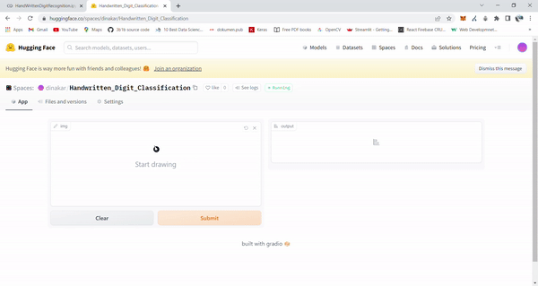

# Hand Written Digit Recognition
## _A Hello world program of ML_
---

### Google Colaboratory Link Here

 

### Hugging faces Live Demo Here

> [Live_demo]

[//]: #

   [Colab_link]: <[https://colab.research.google.com/drive/1_tPuKWVLLeOAiFbtZCBrp7fIsPNE2DTT](https://colab.research.google.com/drive/1_tPuKWVLLeOAiFbtZCBrp7fIsPNE2DTT?usp=sharing)>

   [LIve_demo]: <https://huggingface.co/spaces/dinakar/Handwritten_Digit_Classification>
